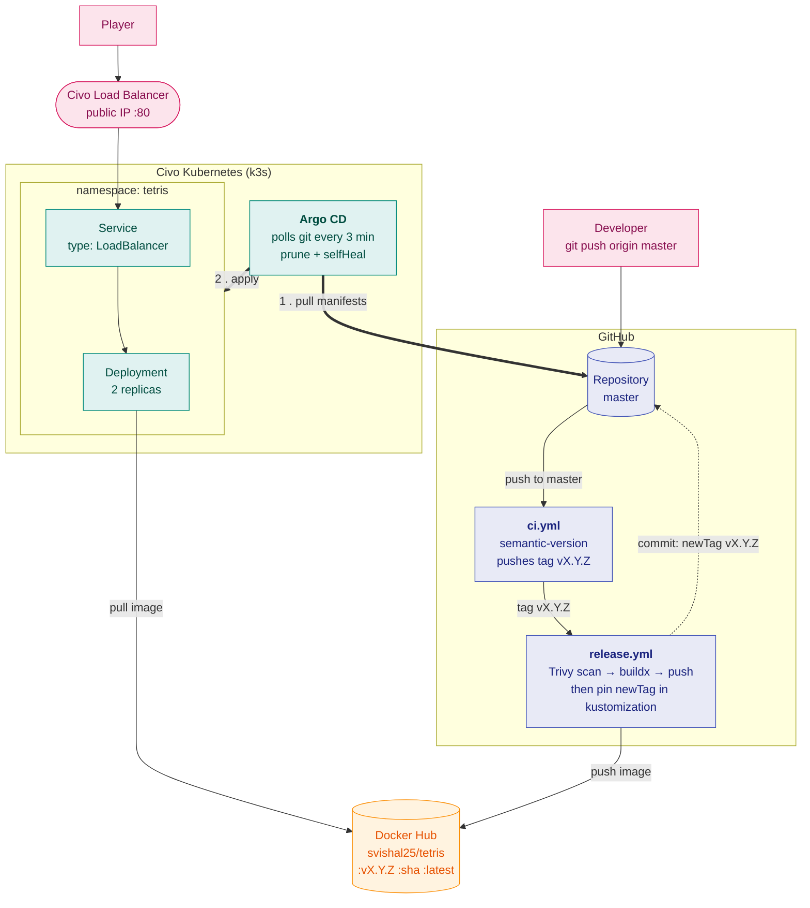
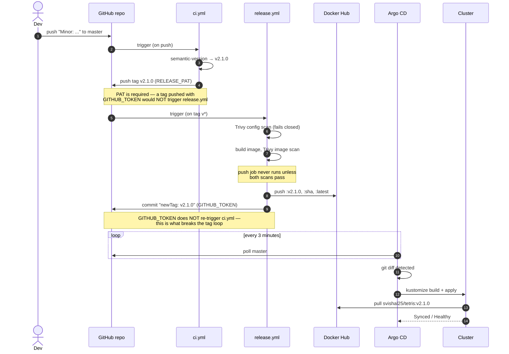
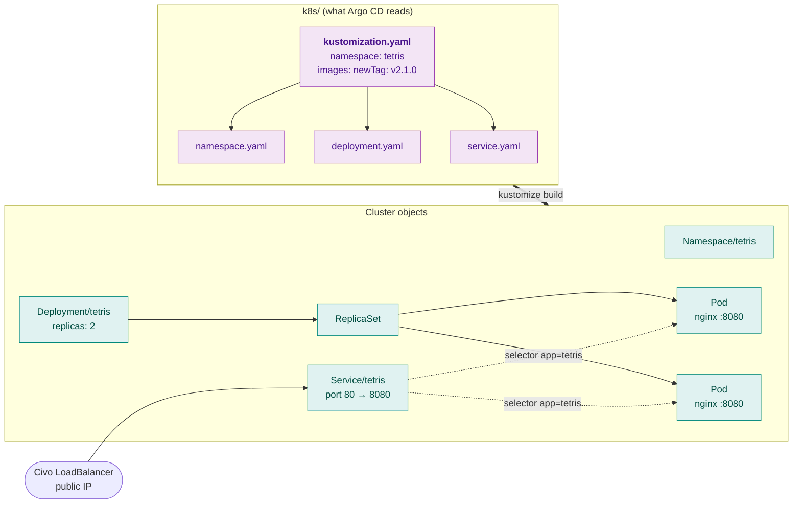

Javascript Tetris
=================

An HTML5 Tetris game used as the payload for a complete **container → CI → GitOps → Kubernetes**
deployment pipeline. The game itself is incidental; the point of this repo is the delivery
mechanism around it.

This is a fork of [jakesgordon/javascript-tetris](https://github.com/jakesgordon/javascript-tetris)
that packages the game as an nginx container image, publishes it to Docker Hub, and deploys it
to a Civo-managed Kubernetes cluster through Argo CD — with no `kubectl` anywhere in the
deploy path.

 * [play the original](https://jakesgordon.com/games/tetris/)
 * read the original [blog article](https://jakesgordon.com/writing/javascript-tetris/)
 * image on Docker Hub: [`svishal25/tetris`](https://hub.docker.com/r/svishal25/tetris)

>> _*SUPPORTED BROWSERS*: Chrome, Firefox, Safari, Opera and IE9+_

---

Project Layout
==============

```
javascript-tetris/
├── index.html                          the whole game (markup, styles, JS)
├── stats.js                            FPS/render stats overlay
├── texture.jpg                         background texture
│
├── Dockerfile                          nginx-unprivileged image, serves on :8080
├── .dockerignore                       keeps k8s/, docs and credentials OUT of the image
├── .gitignore                          keeps the kubeconfig out of git
│
├── .github/workflows/
│   ├── ci.yml                          push to master  -> compute semver, push git tag
│   └── release.yml                     tag push        -> scan, build, push image,
│                                                          then pin the manifest
│
├── k8s/
│   ├── kustomization.yaml              ties the manifests together; holds the image tag
│   ├── namespace.yaml                  the "tetris" namespace
│   ├── deployment.yaml                 2 replicas, hardened pod security context
│   ├── service.yaml                    type: LoadBalancer -> public IP from Civo
│   ├── commands.txt                    full operational runbook + gotchas learned
│   └── argocd/
│       └── application.yaml            registers this repo with Argo CD (applied once)
│
└── civo-tetris-docker-k8s-kubeconfig   *** NOT IN THIS REPO - see below ***
```

The kubeconfig — you must supply your own
-----------------------------------------

`civo-tetris-docker-k8s-kubeconfig` is **deliberately absent from this repository** and is
matched by `.gitignore`. It is not a config file, it is a **credential**: it carries a
non-expiring token with `cluster-admin` on the cluster. Anyone who reads it controls the
cluster completely, and it cannot be revoked on its own — rotating it means deleting the
cluster.

It is also excluded in `.dockerignore`, because the `Dockerfile` does `COPY . /usr/share/nginx/html`.
Without that exclusion the credential would be baked into the published image *and served
over HTTP* by nginx at `/civo-tetris-docker-k8s-kubeconfig`.

To obtain your own:

 1. Sign up at [civo.com](https://www.civo.com) and create a Kubernetes cluster.
    **Use `g4s.kube.medium` or larger** — see the sizing note below.
 2. On the cluster page, click **Download Config**.
 3. Save it into the repository root as `civo-tetris-docker-k8s-kubeconfig`.
 4. Point your shell at it:

```sh
export KUBECONFIG=$PWD/civo-tetris-docker-k8s-kubeconfig
kubectl config current-context     # should print your cluster name
```

> **Node sizing:** the smallest Civo node (`g4s.kube.xsmall`) advertises 940Mi but leaves only
> **499Mi allocatable** after k3s overhead. Argo CD's full stack needs ~1.5–2Gi and will not
> fit — it evicts in a loop rather than failing cleanly. Always size against *allocatable*,
> never capacity.

---

Architecture
============

The whole system, end to end. Nothing in GitHub ever holds a cluster credential — the cluster
reaches **out** to GitHub, not the reverse.



The release sequence
--------------------

Note the two different tokens. This is the single most important detail in the pipeline:
`ci.yml` pushes its tag with a **PAT** *because* it wants to trigger the next workflow, while
`bump-manifest` pushes with the default **`GITHUB_TOKEN`** *because* pushes made with it do
**not** trigger workflows. Swap either one and the repo tag-loops forever.



Kubernetes objects
------------------

`kustomization.yaml` is the entry point — Argo CD detects it and runs `kustomize build` itself.
Its `images:` block is what rewrites the placeholder tag in `deployment.yaml`, which is why
**that one line is the deploy trigger**.



Container hardening
-------------------

The image and pod are locked down well past the defaults:

| Setting | Value | Why |
| --- | --- | --- |
| Base image | `nginxinc/nginx-unprivileged:alpine` | Runs as UID 101, never root |
| Container port | `8080` | Unprivileged — no `NET_BIND_SERVICE` needed |
| `runAsNonRoot` | `true` | Kubelet refuses to start it as root |
| `readOnlyRootFilesystem` | `true` | nginx scratch dirs mounted as `emptyDir` |
| `allowPrivilegeEscalation` | `false` | Blocks setuid escalation |
| `capabilities.drop` | `["ALL"]` | No Linux capabilities at all |
| `seccompProfile` | `RuntimeDefault` | Syscall filtering |
| `imagePullPolicy` | `IfNotPresent` | Safe *because* tags are immutable versions |

---

Running it
==========

Just the container
------------------

```sh
docker run --rm -p 8080:8080 svishal25/tetris:latest
```

Then open <http://localhost:8080>. Or build locally:

```sh
docker build -t tetris .
docker run --rm -p 8080:8080 tetris
```

No Docker at all
----------------

Plain HTML/JS with no build step — open `index.html`, or serve the directory:

```sh
python3 -m http.server 8080
```

On Kubernetes
-------------

Full command reference lives in [`k8s/commands.txt`](k8s/commands.txt), including local
`kind` setup, Argo CD install, rollback and teardown. The short version, once your kubeconfig
is in place:

```sh
export KUBECONFIG=$PWD/civo-tetris-docker-k8s-kubeconfig

# one time: install Argo CD (or use the Civo marketplace)
kubectl create namespace argocd
kubectl apply -n argocd -f https://raw.githubusercontent.com/argoproj/argo-cd/stable/manifests/install.yaml
kubectl -n argocd wait --for=condition=available deploy --all --timeout=300s

# one time: hand the repo to Argo CD. The last kubectl you should ever need.
kubectl apply -f k8s/argocd/application.yaml

# watch it converge
kubectl -n argocd get application tetris -w
```

Argo CD UI:

```sh
kubectl -n argocd get secret argocd-initial-admin-secret -o jsonpath='{.data.password}' | base64 -d; echo
kubectl -n argocd port-forward svc/argo-cd-argocd-server 8081:443
```

Then <https://localhost:8081> as `admin` (self-signed cert warning is expected).

Deploying a change
------------------

```sh
git commit -m "Minor: faster drop speed" && git push origin master
```

That is the entire deploy. `Major:` / `Minor:` prefixes drive the version bump; anything else
is a patch. **Do not** deploy with `kubectl` — `selfHeal: true` reverts manual changes within
seconds. Rollback is a git operation:

```sh
git revert <sha of "chore: deploy vX.Y.Z"> && git push origin master
```

Required repository secrets
---------------------------

| Secret | Used by | Purpose |
| --- | --- | --- |
| `DOCKERHUB_USERNAME` | `release.yml` | Docker Hub login |
| `DOCKERHUB_TOKEN` | `release.yml` | Docker Hub access token |
| `RELEASE_PAT` | `ci.yml` | Tag push that **must** trigger `release.yml` |

No Kubernetes credential is stored in GitHub. That is the whole point of the pull-based model.

---

Security note
=============

Argo CD's default install binds its controller to a `ClusterRole` of
`apiGroups: ["*"], resources: ["*"], verbs: ["*"]` — full cluster-admin. The GitOps model
removes the cluster credential from GitHub, but the authority does not disappear; it moves
into the cluster. **Write access to `k8s/` on `master` is therefore equivalent to cluster-admin.**
Protect the branch accordingly, and scope the controller's RBAC down for anything beyond a
learning cluster.

License
=======

[MIT](http://en.wikipedia.org/wiki/MIT_License) license.
